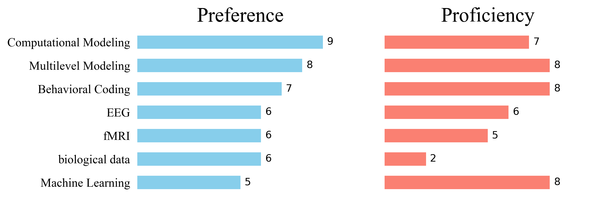

I am a Ph.D. student in Developmental Psychology at Pennsylvania State University, working with Dr. Koraly Pérez-Edgar in the [Cognition, Affect, and Temperament Lab](https://www.catlabpsu.com). I am also planning to pursue a dual title degree in Social Data Analytics.

## Education

  

    Ph.D. in Developmental Psychology, Pennsylvania State University 
    2025 to Present
  

  
<em>Advisor: Dr. Koraly Pérez-Edgar</em>

  

    B.S. in Psychology, Peking University 
    2020 to 2025
  

<section class="researchMap">
  
Research Map

  

    <article class="researchNode">
      01
      <h3>Social Signals</h3>
      
How children attend to, interpret, and internalize emotionally meaningful social information.

    </article>

    →

    <article class="researchNode">
      02
      <h3>Temperament</h3>
      
How behavioral inhibition shapes selective engagement with social and affective information.

    </article>

    →

    <article class="researchNode">
      03
      <h3>Adaptation</h3>
      
How early social experiences contribute to adaptation and anxiety across development.

    </article>
  

</section>

## Research Interest

My research examines how children engage in social and affective processing, including how they attend to, interpret, and internalize emotionally meaningful social signals. In early childhood, these signals are conveyed primarily through key social partners, including parents and peers. I am particularly interested in the active and selective nature of this process, how it reflects children's temperament, and how it supports adaptation to the social environment.

My work pursues two complementary aims. First, I seek to capture social and affective processing as it unfolds in everyday life. I use time intensive longitudinal methods and fine grained experimental paradigms that move beyond static self report measures, allowing me to examine how children construct meaning from social experiences in real time.

Second, I aim to identify the general mechanisms and individual differences that shape this process. I develop and test theoretical models of social and affective processing across contexts. I also examine the role of temperament, particularly behavioral inhibition, in shaping how selectively and intensely children engage with social and affective information and in contributing to anxiety across childhood and adolescence.

*For Research Methods*

<em>Notes:</em> For preference, 1 means prefer not to use it, 5 means neutral and use only when necessary, and 9 means eager to use it whenever relevant. For proficiency, 1 means no prior experience, 5 means basic knowledge but not independent use, 7 means fluent use, and 9 means native level fluency.

My advisor uses a metaphor to describe research methods as languages: a mother tongue, a fluent language, a language one can read but not speak, or an unfamiliar language. I use the same metaphor to introduce my methodological training. As an early stage researcher, I consider both my preference and proficiency for each method.

## Previous Experience

As an undergraduate, I worked on projects spanning developmental neuroscience, parent child relationships, social anxiety, and adolescent intervention.

* **Dr. Ka Ip, University of Minnesota**  
  Neighborhood influences on brain structure.

* **Dr. Zhi Li, Mt. Hope Family Center, University of Rochester**  
  Parent child relationships and children's sensory processing sensitivity.

* **Dr. Yujia Peng, Peking University**  
  Cognitive processes in social anxiety.

* **Dr. Yinyin Zang, Peking University**  
  Adolescent interventions.

Outside of research, I survive on three nutrients: board games, drums, and travel.
